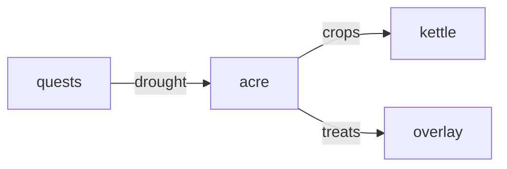

# Acre

**Pet Farm Tycoon** — Farming simulator growing specialized crops and pet treats for the care loop.

Part of [ComputerPets](https://github.com/RicheyWorks/computerpets). Map: [computerpets-ecosystem](https://github.com/RicheyWorks/computerpets-ecosystem).

| | |
| --- | --- |
| Status | Design scaffold — loop and engine frozen |
| License | MIT |
| Tokens | Minigames never mint or burn. Tired overlay, not a dead lineage. |
| First pet | [Meet Rui first](https://github.com/RicheyWorks/computerpets/blob/main/docs/START-HERE.md). This game is optional. |

## The loop

Treats have to come from somewhere. Acre is the field: bamboo, brine-weed, pond cress. Crops buff species that canonically eat them.

## Who plays

Players growing species-legal food.

## What it is not

A cash shop for rain.

## Genre and engine

- Genre: **Farming sim**
- Engine: **Unity**
- Stack: Unity 6 · C# · crop tables per biome · treats feed Kettle and overlay
- Default surface: `Unity editor`

## Architecture



## How you play

1. Plot grid. Plant biome-legal seeds.
2. Pets assigned as farmhands (idle).
3. Harvest → inventory → Kettle or feed.
4. Drought day from Quests seed.

## First slice

Build this and stop.

**Bamboo plot, one harvest into feed inventory.**

You know it works when: Wrong crop withers with an explanation. Server down: local day continues.

## Environment

Unity 6

## Failure doctrine

Wrong crop for species → wither, explain. Server down → local day continues, sync later. No microtransactions for rain.

Canon rules that never yield:

- 210 living kinds. No illegal hybrids.
- Overlay pets can get tired, sick, or hide. Tokens are not burned by a minigame.
- Desktop walk stays the main quest. Closing Acre must leave Rui walking.

## Neighbors

- computerpets-kettle
- computerpets-lure
- computerpets-hearth
- computerpets-ledger
- computerpets-quests

## Layout

```
computerpets-acre/
  README.md
  LICENSE
  docs/DESIGN.md
  src/                implementation lands here
```

## Run (Windows)

```powershell
Unity Hub > Acre/; play mode.
```

Meet Rui first via the [flagship start-here](https://github.com/RicheyWorks/computerpets/blob/main/docs/START-HERE.md). This game is optional.

## Links

- Flagship: [RicheyWorks/computerpets](https://github.com/RicheyWorks/computerpets)
- This repo: [RicheyWorks/computerpets-acre](https://github.com/RicheyWorks/computerpets-acre)
- Map: [RicheyWorks/computerpets-ecosystem](https://github.com/RicheyWorks/computerpets-ecosystem)
- Design file: [docs/DESIGN.md](docs/DESIGN.md)

## License

MIT. See [LICENSE](LICENSE).

---

*Two hundred ten living kinds. Keep them so a line does not go quiet.*
